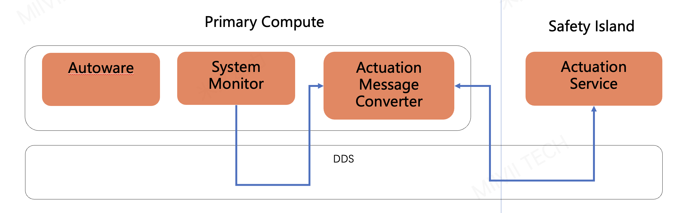
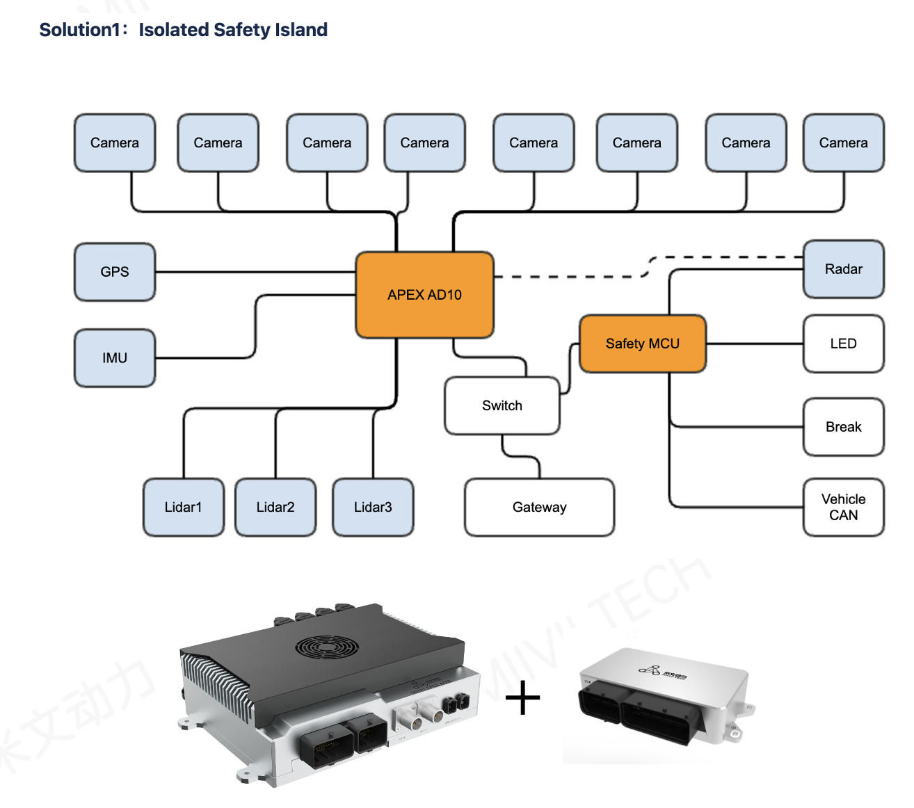
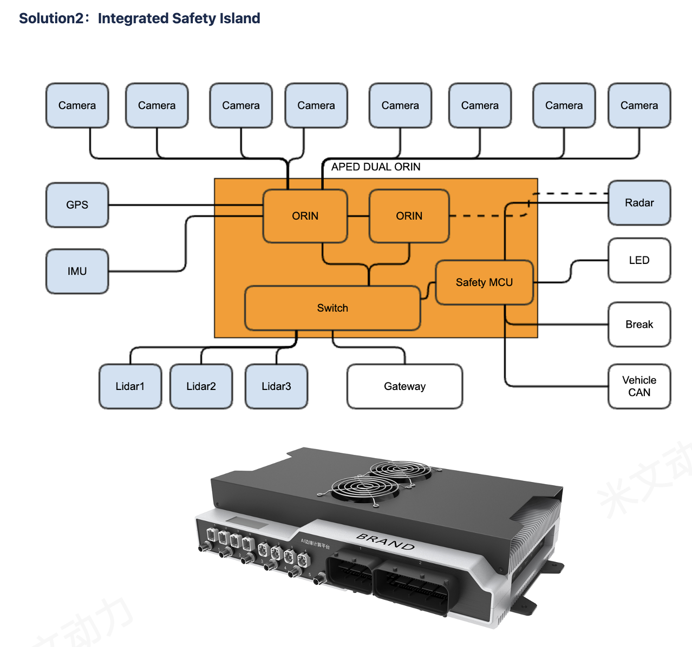

# Autoware Safety Island Architecture

## Vision
In the era of autonomous systems, the importance of safety architecture cannot be overstated. However, the industry currently lacks a unified consensus on safety implementation, resulting in a diverse array of safety solutions. Some approaches even equate traditional solutions like Autosar directly with safety architecture, which clearly cannot meet the demands of modern autonomous driving.

We firmly believe that the industry needs an open and modernized safety architecture standard that is:
- Open and transparent for industry reference and improvement
- Based on modern software engineering best practices
- Practical and feasible for implementation

## Project Origin
This project builds upon the foundational work of the Autoware Safety Working Group. Special thanks to:
- Autoware Safety WG for establishing the foundation of autonomous driving safety architecture
- ARM Corporation for their significant contributions to the working group

## Architecture Overview

### System Architecture Diagram

### Hardware Support

| Isolated Solution | Integrated Solution |
|-----------|-------------|
|  |  |
| APEX AD10 + SAFETY BOX | APEX DUAL ORIN (TO BE SUPPORTED)|

## Roadmap

### Phase 1: Critical Component Failure Handling

Our first phase focuses on comprehensive failure handling for all critical sensors and systems:

| Category | Component | Failure Case | Handling Strategy |
|----------|-----------|--------------|------------------|
| Critical System | ORIN | System Failure | Automatic Reboot & Recovery |
| Critical Sensor | Camera | Signal Loss/Malfunction | Degraded Operation Mode |
| Critical Sensor | LiDAR | Signal Loss/Malfunction | Fallback to Radar + Camera |
| Critical Sensor | Radar | Signal Loss/Malfunction | Fallback to LiDAR + Camera |

#### Key Objectives:
- Implement robust failure detection mechanisms
- Develop graceful degradation strategies
- Ensure safe state transitions during component failures
- Validate recovery procedures

#### Implementation Priority:
1. System-level failure handling (ORIN)
2. Primary sensor failure handling
   - Camera failure scenarios
   - LiDAR failure scenarios
   - Radar failure scenarios
3. Multi-sensor fusion degradation handling

#### Expected Deliverables:
- Failure detection and handling documentation
- Safety response specifications
- Testing and validation procedures
- Performance metrics for failure scenarios

## Open Source Scope
Due to commercial considerations, this project does not include specific implementations based on Zephyr RTOS. Our open-source content includes:
- Overall architectural design
- Interface definitions
- Safety policies
- Verification methods

## Why Open Source?
1. Promote Industry Standardization
   - Foster in-depth discussions on safety architecture through open source
   - Accelerate the formation of industry consensus

2. Drive Technical Progress
   - Gather community wisdom
   - Collectively improve and optimize solutions

3. Lower Implementation Barriers
   - Provide reference architecture design
   - Reduce enterprise safety implementation costs

## Contributing
We welcome community contributions in the following forms:
- Architecture improvement suggestions
- Documentation enhancement
- Usage feedback
- Issue reporting

## License
This project is licensed under the Apache License, Version 2.0 - see the [LICENSE](LICENSE) file for details.

## Contact Us
[Linkedin](https://www.linkedin.com/company/104235594)

## References
- [Safety Island Actuation Demo Documentation](https://safety-island-actuation-demo.docs.arm.com/) - Official ARM documentation for Safety Island implementation and actuation demo
- [Autoware Documentation](https://autowarefoundation.github.io/autoware-documentation/) - Autoware Documentations
- [SOAFEE Documentation](https://soafee.io/) - Software-defined vehicle architecture reference

## Acknowledgments
We would like to express our gratitude to:
- Special thanks to @samet-kutuk, @mohammad-deepen, @kaspermeck-arm, Miodrag, and Sergey for their continuous encouragement, valuable feedback and support throughout this project
- The Autoware Foundation and its community for their pioneering work in autonomous driving
- ARM Corporation for their technical guidance and support
- The SOAFEE Their vision of creating a shared, hardware-agnostic platform using cloud-native architecture has been instrumental in shaping this project.
- The Zephyr Project for providing a robust RTOS foundation
